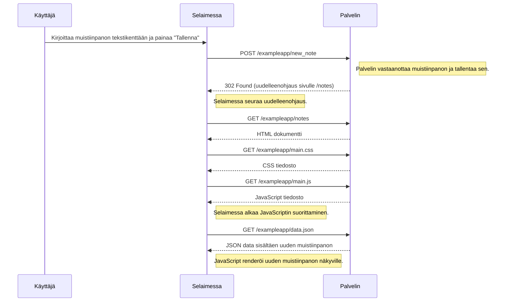

```mermaid
sequenceDiagram
    participant User as Käyttäjä
    participant Browser as Selaimessa
    participant Server as Palvelin

    User->>Browser: Kirjoittaa muistiinpanon tekstikenttään ja painaa "Tallenna"
    Browser->>Server: POST /exampleapp/new_note
    Note right of Server: Palvelin vastaanottaa muistiinpanon ja tallentaa sen.

    Server-->>Browser: 302 Found (uudelleenohjaus sivulle /notes)
    Note right of Browser: Selaimessa seuraa uudelleenohjaus.

    Browser->>Server: GET /exampleapp/notes
    Server-->>Browser: HTML dokumentti
    Browser->>Server: GET /exampleapp/main.css
    Server-->>Browser: CSS tiedosto
    Browser->>Server: GET /exampleapp/main.js
    Server-->>Browser: JavaScript tiedosto

    Note right of Browser: Selaimessa alkaa JavaScriptin suorittaminen.

    Browser->>Server: GET /exampleapp/data.json
    Server-->>Browser: JSON data sisältäen uuden muistiinpanon
    Note right of Browser: JavaScript renderöi uuden muistiinpanon näkyville.
```
