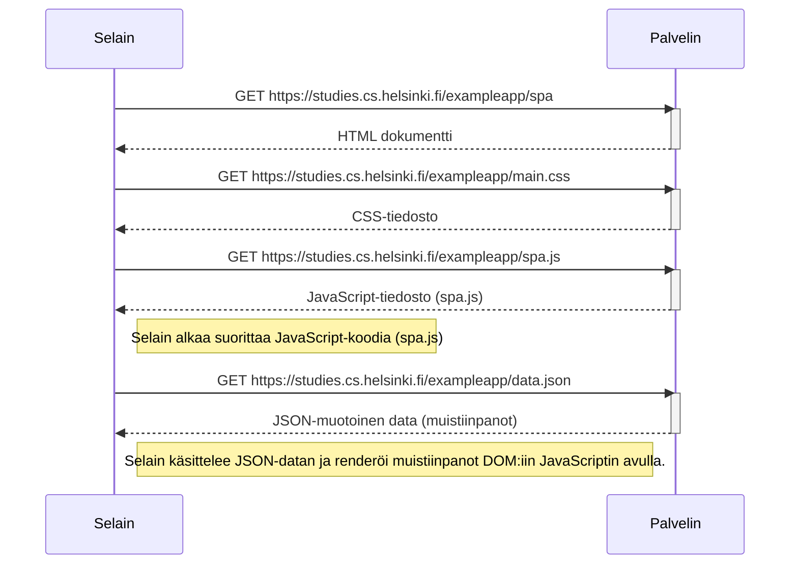

```mermaid

sequenceDiagram
    participant browser as Selain
    participant server as Palvelin

    browser->>server: GET https://studies.cs.helsinki.fi/exampleapp/spa
    activate server
    server-->>browser: HTML dokumentti
    deactivate server

    browser->>server: GET https://studies.cs.helsinki.fi/exampleapp/main.css
    activate server
    server-->>browser: CSS-tiedosto
    deactivate server

    browser->>server: GET https://studies.cs.helsinki.fi/exampleapp/spa.js
    activate server
    server-->>browser: JavaScript-tiedosto (spa.js)
    deactivate server

    Note right of browser: Selain alkaa suorittaa JavaScript-koodia (spa.js)

    browser->>server: GET https://studies.cs.helsinki.fi/exampleapp/data.json
    activate server
    server-->>browser: JSON-muotoinen data (muistiinpanot)
    deactivate server

    Note right of browser: Selain käsittelee JSON-datan ja renderöi muistiinpanot DOM:iin JavaScriptin avulla.


```