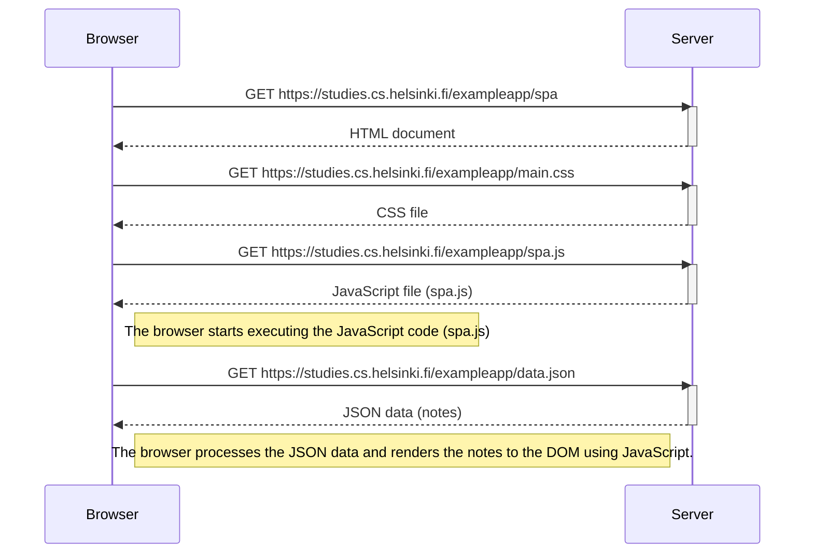

```mermaid

sequenceDiagram
    participant browser as Browser
    participant server as Server

    browser->>server: GET https://studies.cs.helsinki.fi/exampleapp/spa
    activate server
    server-->>browser: HTML document
    deactivate server

    browser->>server: GET https://studies.cs.helsinki.fi/exampleapp/main.css
    activate server
    server-->>browser: CSS file
    deactivate server

    browser->>server: GET https://studies.cs.helsinki.fi/exampleapp/spa.js
    activate server
    server-->>browser: JavaScript file (spa.js)
    deactivate server

    Note right of browser: The browser starts executing the JavaScript code (spa.js)

    browser->>server: GET https://studies.cs.helsinki.fi/exampleapp/data.json
    activate server
    server-->>browser: JSON data (notes)
    deactivate server

    Note right of browser: The browser processes the JSON data and renders the notes to the DOM using JavaScript.


```