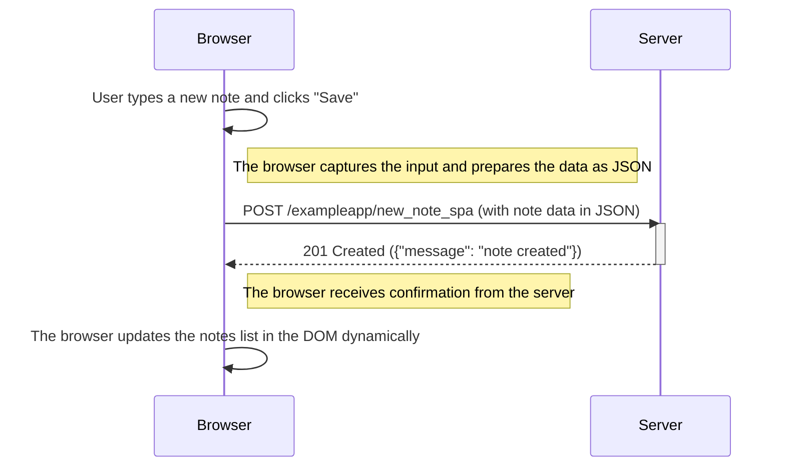

```mermaid
sequenceDiagram
    participant browser as Browser
    participant server as Server

    browser->>browser: User types a new note and clicks "Save"
    Note right of browser: The browser captures the input and prepares the data as JSON

    browser->>server: POST /exampleapp/new_note_spa (with note data in JSON)
    activate server
    server-->>browser: 201 Created ({"message": "note created"})
    deactivate server

    Note right of browser: The browser receives confirmation from the server
    browser->>browser: The browser updates the notes list in the DOM dynamically
```